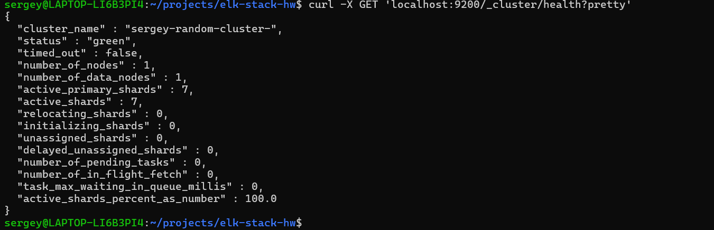
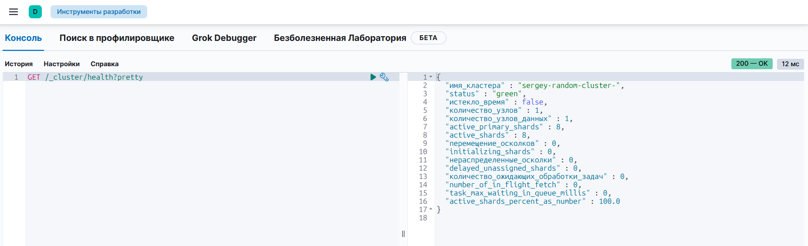
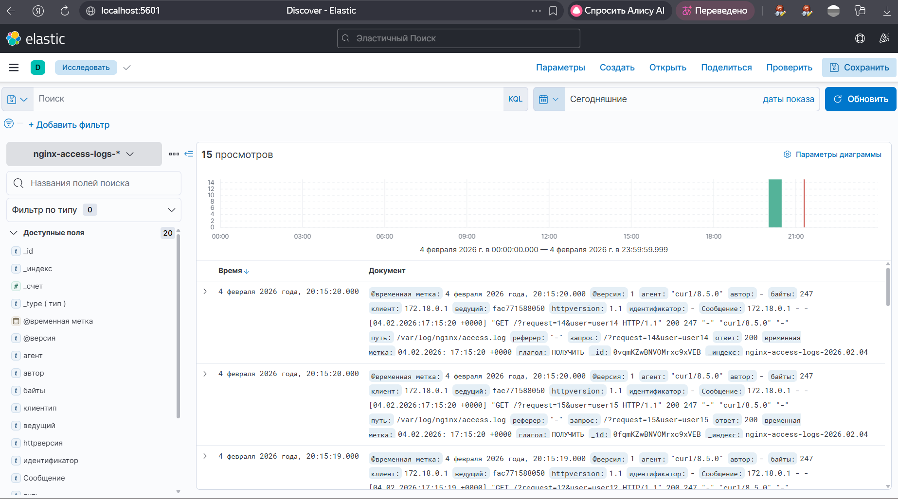
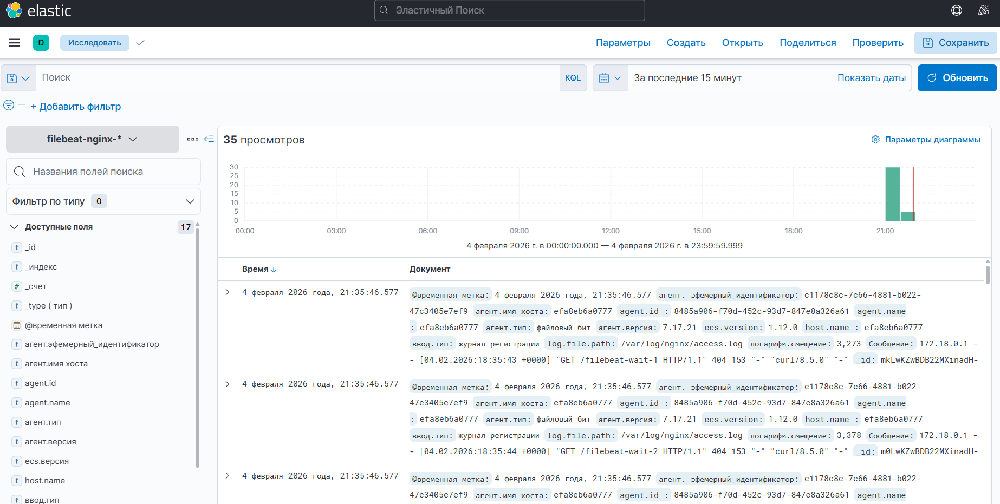

# Домашняя работа по ELK Stack и Filebeat

## Выполнил: Сергей Овсянников

## Задание 1. Elasticsearch
Установлен Elasticsearch с именем кластера: sergey-devops-cluster

## Задание 2. Kibana  
Kibana установлена и доступна по http://localhost:5601

## Задание 3. Logstash
Logstash отправляет логи Nginx в Elasticsearch

## Задание 4. Filebeat
Filebeat настроен для отправки логов Nginx в Elasticsearch

